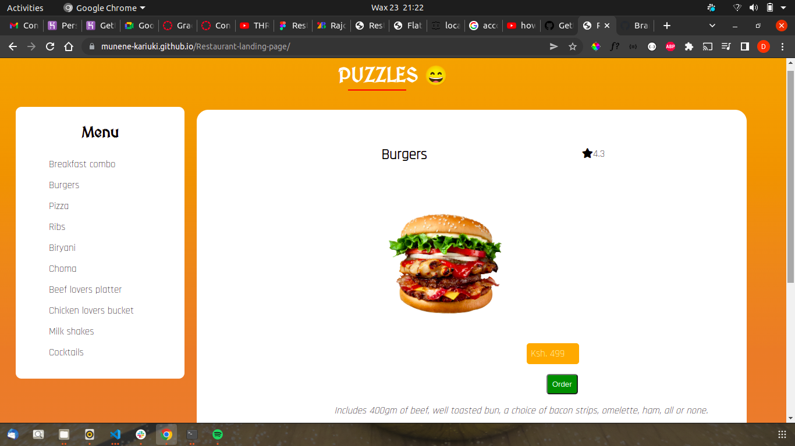

 # RESTAURANT LANDING PAGE

This is a simple application showing food offers at a restaurant. It uses HTML and CSS for the front-end, and JavaScript for the backend.

#### By **Denis** created on, 23RD June 2022

## Screenshot
   


## Table of Content

- [Description](#description)
- [Behavior of the website](#siteBehavior)
- [Development and set up](#setUp)
- [Prerequisites](#Prerequisites)
- [Live link](#Live-Link)
- [Technology Used](#technology-Used)
- [Licence](#licence)
- [Authors Info](#Authors-info)

## Description

This is a restaurant landing page showing all the offers available at puzzles bar and restaurant. The application uses HTML, CSS and JS in development.

## Behaviour of the website
### View
+ The website is visually appealing
+ Clicking the menu items renders menu item details on the page
+ The order button processes the order
+ Clicking on the reviews deletes them
+ Submitting a review appends it on the review list


## Development and Setup.

### prerequisites
+ First clone the project to your computer. ```git clone <repo url>```
+ Ensure you have text editor such as Vs code installed.
+ Extract the files and open them in the editor.
+ Run the index.html file in your browser.


### Live Link
* The live link for the project is https://munene-kariuki.github.io/Restaurant-landing-page/

## Technology and Tools Used

+ HTML5
+ CSS5
+ JavaScript
- Git - Version control
- Vs code- Code editor


## Licence
MIT License

Copyright (c) [2022] [Denis Kariuki]

Permission is hereby granted, free of charge, to any person obtaining a copy
of this software and associated documentation files (the "Software"), to deal
in the Software without restriction, including without limitation the rights
to use, copy, modify, merge, publish, distribute, sublicense, and/or sell
copies of the Software, and to permit persons to whom the Software is
furnished to do so, subject to the following conditions:

The above copyright notice and this permission notice shall be included in all
copies or substantial portions of the Software.

THE SOFTWARE IS PROVIDED "AS IS", WITHOUT WARRANTY OF ANY KIND, EXPRESS OR
IMPLIED, INCLUDING BUT NOT LIMITED TO THE WARRANTIES OF MERCHANTABILITY,
FITNESS FOR A PARTICULAR PURPOSE AND NONINFRINGEMENT. IN NO EVENT SHALL THE
AUTHORS OR COPYRIGHT HOLDERS BE LIABLE FOR ANY CLAIM, DAMAGES OR OTHER
LIABILITY, WHETHER IN AN ACTION OF CONTRACT, TORT OR OTHERWISE, ARISING FROM,
OUT OF OR IN CONNECTION WITH THE SOFTWARE OR THE USE OR OTHER DEALINGS IN THE
SOFTWARE.

## Author's info
Linked in - [Denis Kariuki]